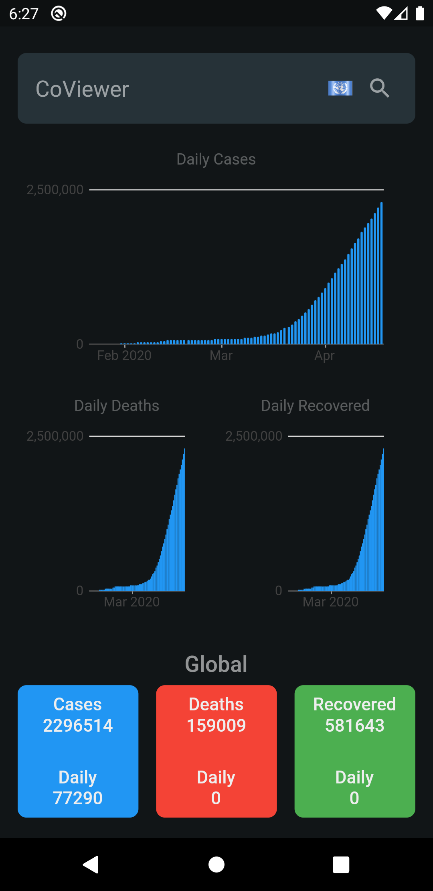
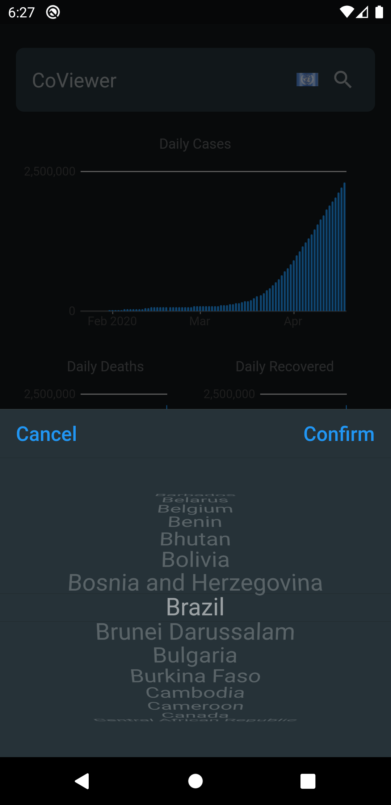
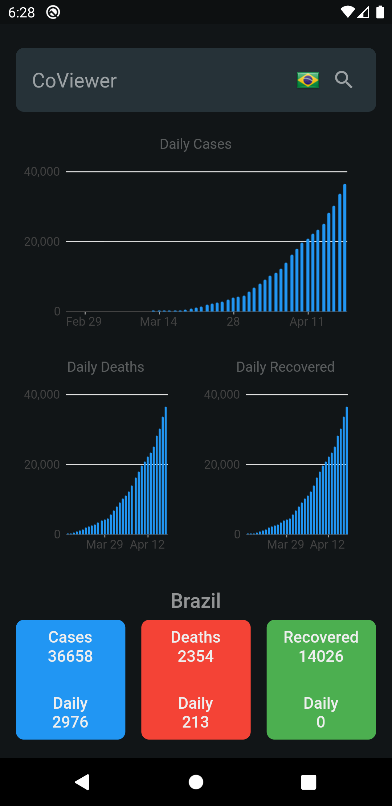

# CoViewer Flutter

This is a Flutter app that shows data and charts about the Covid 19 disease evolution in a majority of countries in the world.

      

## Libraries Used
- Flutter SDK
- http (https://pub.dev/packages/http)
- flutter_picker (https://pub.dev/packages/flutter_picker)
- provider (https://pub.dev/packages/provider)
- charts_flutter (https://pub.dev/packages/charts_flutter)

## API

I've used the Pomber/Covid19 Json time-series as the major API.
It can be found in https://github.com/pomber/covid19.
Thanks for making it available to all of us!

## APK
**Android**
Build and install a release version on Android.

**Build the APK**
From the command line:

1.  Enter  `cd <app dir>`  
    (Replace  `<app dir>`  with CoViewer directory)
2.  Run `flutter pub get` 
     (to install all the packages required)
3.  Run  `flutter build apk --split-per-abi`  
    (The  `flutter build`  command defaults to  `--release`.)
    
**Install the APK on a device**

Follow these steps to install the APK on a connected Android device.

From the command line:

1.  Connect your Android device to your computer with a USB cable.
2.  Enter  `cd <app dir>`  where  `<app dir>`  is CoViewer directory.
3.  Run  `flutter install`.
    

## How to contribute..??

If you are reading this README.md file then you have already opened the repository.
Now you can go to the ISSUES section on top (beside CODE section). There you will
find various issues and you can choose one or multiple to fix. 

To fix the issue read the requirement properly and understand the issue, then you can 
fork a copy of the project so that you can work on it locally on your system. You can 
also read above on how to run the code locally. After fixing the code you can generate 
a pull request to the maintainer of this project. Who will then verify the project and 
revert back to you with his feedback, and accordingly you can make changes. If the 
maintainer is satisfied with your work, he will merge your patch in the project.

